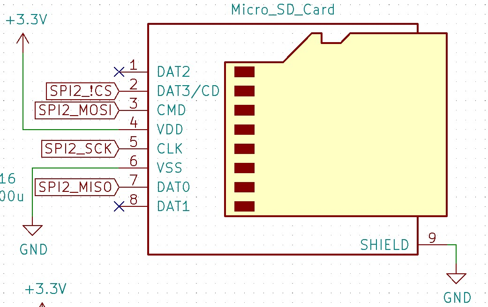
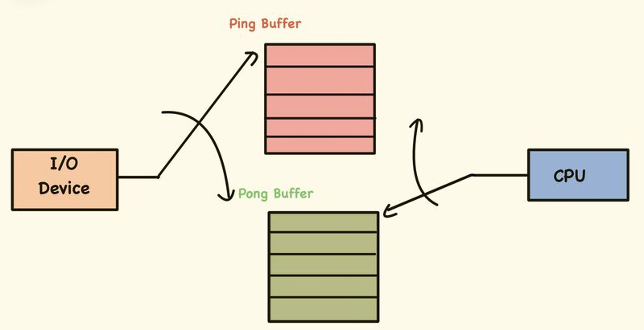
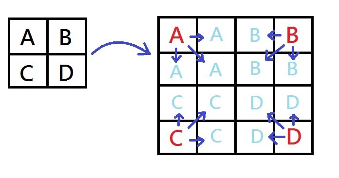

# FPGA microSD GIF Displayer and Filter

**Course:** Hardware Synthesis Lab (2110363)  
**Semester:** Year 2, Semester 2   
**Institution:** Chulalongkorn University

---

## 👥 Project Members
* Anantawat Tinprapa (6631357021)
* Chayakorn Unhasirikul (6632039621)
* Piyongkul Rardyota (6632134521)

## 📖 Project Summary
This project implements a complete hardware-based image streaming and processing pipeline on a **Basys3 FPGA (Artix-7)**. The system reads raw animation data from a microSD card via a custom SPI controller, performs real-time upscaling, and drives a VGA display at 640×480 resolution.

 
   
To demonstrate hardware efficiency, the design bypasses standard file systems (FAT32) in favor of raw sector addressing, allowing for high-throughput streaming despite the Artix-7's limited Block RAM (1,800 Kb) resources. It features a real-time DSP pipeline capable of RGB-to-HSV conversion and applying dynamic filters (Grayscale, Inversion, Hue Shift) with little latency.

---

## ⚙️ Technical Architecture

### 1. Custom SPI MicroSD Controller
* **Protocol:** Implemented a lightweight **Serial Peripheral Interface (SPI)** master in Verilog to communicate with SDHC/SDXC cards.
* **Direct Memory Access (Raw Sector Read):**
    * Eliminated the overhead of a filesystem (FAT32/exFAT) and image decoding logic (PNG/GIF) to minimize logic gate utilization.
    * Data is read directly from specific **Logical Block Addresses (LBA)** on the SD card.
    * Achieved deterministic read timing required for smooth video playback without a dedicated frame buffer for the full VGA resolution.

### 2. Memory Management & Data Pipeline
Given the Basys3's 1800Kb Block RAM constraint, storing a full 640×480 framebuffer is impossible. The system utilizes a **Streaming Architecture**:
* **Pre-Processing (Software):** A custom Python script converts GIFs into a hardware-friendly binary format:
    * **Downsampling:** Source frames resized to 64×48 pixels.
    * **Color Quantization:** Converted standard 24-bit RGB to **16-bit RGB565** (5 bits Red, 6 bits Green, 5 bits Blue) to reduce bandwidth by 33%.
    * **Serialization:** Frames are flattened and written sequentially to SD card sectors.
* **Hardware Buffering:**
    * Implements a **Ping-Pong Buffer** (or Circular FIFO) strategy: While one frame is being displayed, the SPI controller prefetches the next frame into BRAM.
    * This ensures seamless animation playback and synchronization between the slow SD card read speeds and the fast VGA refresh rate (60Hz).

### 3. VGA Display & Hardware Upscaling
* **Resolution:** 640×480 @ 60Hz industry standard timing.
* **Scaling Logic:** Implemented a **10x  Nearest-neighbor Upscaling** algorithm in hardware.
    * The 64×48 source image is mapped to the 640×480 output dynamically during the pixel clock cycles, removing the need to store the upscaled image in memory.

### 4. Real-Time DSP & Filter Logic
Implemented a pipelined combinatorial logic block for real-time pixel manipulation.
* **RGB to HSV Conversion:** Developed an optimized Verilog module to convert the RGB color space to Hue-Saturation-Value.
    * *Optimization:* Approximated complex division and modulus operations using fixed-point arithmetic and bit-shifting to maintain timing closure.
* **Filter Modes (Selectable via Buttons):**
    * **Grayscale:** Weighted average algorithm ($R*0.3 + G*0.59 + B*0.11$).
    * **Inversion:** Bitwise NOT operation on pixel data.
    * **Hue Shift:** Modifies the 'H' value in the HSV domain and converts back to RGB, allowing for dynamic color cycling effects.

---

## 🛠️ Technology Stack

| Category | Tools & Technologies |
| :--- | :--- |
| **HDL** | Verilog (SystemVerilog compatible) |
| **Protocols** | SPI (SD Card), UART (Debug), VGA (Display) |
| **Hardware** | Digilent Basys3 (Xilinx Artix-7 FPGA) |
| **EDA Tools** | Xilinx Vivado (Synthesis, Implementation, Bitstream) |
| **Scripting** | Python (Image pre-processing, Binary generation) |

---

